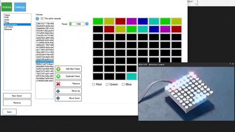

# E-19 RGB 8x8 Display

**Project Status:** Ready to manufacture

If you are new to GitHub and would like to create a derivative of this project, please have a look at GitHub instructions to [fork a repo](https://help.github.com/en/articles/fork-a-repo)

## Description

Out of our passion to solve the issue of time waste in the robot creation process, EZ-Builder was born. The EZ-Builder software platform reduces the time it takes to get from idea to implementation. Since 2011 we have been listening to the challenges robot builders encounter and continue to provide them with an ever expanding toolbox of solutions. Join us on this journey!

We didn't stop at the software, we also made time saving hardware solutions. This RGB Matrix display reference design is one of them. It has 64 (8x8 matrix) Full color LEDs. Each LED can be individually controlled by EZ-builder to form messages, pictures, games, and more! A unique feature of this display is that it is a smaller form factor (48x48mm) than common RGB matrix dispalys (60x60mm). We want to share these files with you so you can create your own version for your community and customers to enjoy!

**Features:**
- I2C communication
- Adjustable I2C address for chaining multiple displays
- PIC programming header
- 5V tolerant I/O pins
- Address displayed on boot
- EZ-Builder behavior control available
- Small form factor RGB display
- Vibrant Green color, better than majority of matrix displays 
- Voltage requirement: 3.2-3.4VDC (3.3V Typical)
- Current draw: All LEDs off - 6.6mA, All Blue - 86mA, All Green - 106mA, All Red - 154mA, All White - 273mA
- Dimensions: 48(W) x 48(L) x 15.6(H) (mm)

**Major components:** 
- HS-19088BSRND-GG RGB 8x8 LED Matrix
- PIC16F1937 PIC microcontroller (custom firmware provided)

**Manufacturing notes:** 
1. Supplier: programs custom firmware into the PIC16F1937 at their facility before sending to manufacturer
2. Manufacturer: Single side placement and soldering of SMT components
3. Manufacturer: Dual Side soldering of THT components

## Contents

[**Documentation:**](https://github.com/synthiam/E-19_RGB_8x8_Display/tree/master/E-19%20Documentation) Schematic PDF, Datasheet PDF, BOM, Assembly Notes, Test Procedures

[**Hardware:**](https://github.com/synthiam/E-19_RGB_8x8_Display/tree/master/E-19%20Hardware) Altium PCB design File, Altium SCH Design File, Gerbers

[**Firmware:**](https://github.com/synthiam/E-19_RGB_8x8_Display/tree/master/E-19%20Firmware) Code, Compiled Hex

*Altium Libraries are also available <a href="https://github.com/synthiam/Synthiam_Altium_Librairies">here</a>*

## Photos

## Roll Out Video

This Roll-out Video includes:

1. Feature set 
2. Hook-up guide 
3. Using Synthiam EZ-Builder Software Behavior Control
4. Schematic overview
5. Bill of Materials (BOM) overview
6. Custom firmware location
7. Assembly instructions 

Link: https://youtu.be/Iwhcii0WCHs

## EZ-Builder Behavior Control

The EZ-Builder behavior control for this reference design is very easy to use! Simply add an animation frame, click on the pixels, choose the color, and repeat! Activate the animations with the click of a mouse button or with code. 

Link: https://synthiam.com/Software/Manual/RGB-8x8-Animator-16173

## Contact

For profit use of these files requires written consent. Contact partners@synthiam.com. For everyone else, party on!

Synthiam Website: https://synthiam.com

## License

This project is released under the following licenses:

**Hardware:** Creative Commons Plus Attribution-NonCommercial 4.0 International (CC+ BY-NC 4.0)

**Firmware:** Apache 2.0 + “Commons Clause” License Condition v1.0

Please see [LICENSE.md](https://github.com/synthiam/E-19_RGB_8x8_Display/blob/master/LICENSE.md) for license details.

